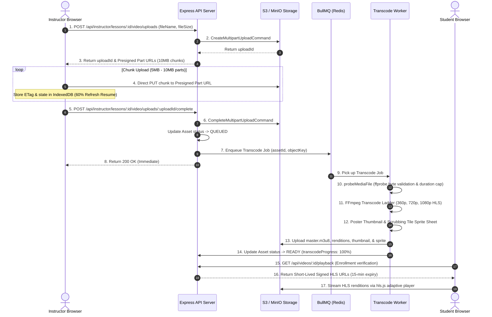

# PRISM Video Upload, Transcoding & Delivery Pipeline Architecture

This document details the production-grade video pipeline implemented for Phase 2 of the PRISM Learning Platform spec.

---

## 1. High-Level Architecture Diagram



---

## 2. Direct S3 Resumable Uploads & Refresh State Persistence

### Resumability Architecture
- **Presigned Chunks**: The browser requests presigned URLs for 10MB parts and streams binary chunks directly to S3. Large 2GB files are **never proxied through Express/Next.js**.
- **IndexedDB State Persistence**: The upload widget stores session metadata (`uploadId`, `objectKey`, `completedParts`, `ETags`) under key `prism_upload_${lessonId}` in browser `IndexedDB`.
- **60% Browser Refresh Recovery**: If an instructor closes the browser or refreshes at 60%, re-opening the upload widget detects stored ETags, skips uploaded chunks 1 through 30, and resumes from chunk 31 cleanly without starting over from 0%.

---

## 3. Untrusted Media Validation (`ffprobe`)

Before handing uploaded files to FFmpeg:
- The worker executes `ffprobe -v error -show_entries format=format_name,duration -show_streams -print_format json`.
- **Magic Byte Inspection**: Verifies actual container format (e.g. `mp4`, `mov`, `matroska`, `webm`), video codec presence, and max duration limit ($\le 4$ hours).
- **Security Defense**: A `.zip` or executable file renamed to `.mp4` is rejected immediately during `PROBING`, marking Asset `status = FAILED` and logging the failure.

---

## 4. FFmpeg Encoding Ladder & Flags Explained

### Encoding Ladder Specifications

| Resolution | Bitrate | Max Bitrate | Buffer Size | Audio Bitrate | Keyframe GOP |
| :--- | :--- | :--- | :--- | :--- | :--- |
| **360p** (640x360) | 800 kbps | 900 kbps | 1200 kbps | 96 kbps | 48 frames (2s) |
| **720p** (1280x720) | 2500 kbps | 2800 kbps | 3600 kbps | 128 kbps | 48 frames (2s) |
| **1080p** (1920x1080) | 5000 kbps | 5500 kbps | 7000 kbps | 192 kbps | 48 frames (2s) |

### FFmpeg Command Flags Rationale

```bash
ffmpeg -y -i input.mp4 \
  -vf "scale=w=1280:h=720:force_original_aspect_ratio=decrease" \
  -c:v libx264 -preset medium \
  -b:v 2500k -maxrate 2800k -bufsize 3600k \
  -g 48 -keyint_min 48 -sc_threshold 0 \
  -c:a aac -b:a 128k \
  -hls_time 6 -hls_playlist_type vod \
  -hls_segment_filename "720p/segment%03d.ts" \
  "720p/playlist.m3u8"
```

- `-c:v libx264`: Standard H.264 video codec guaranteed to play across all desktop and mobile browsers.
- `-preset medium`: Provides optimal balance between encoding speed and storage compression.
- `-g 48 -keyint_min 48 -sc_threshold 0`: Forces keyframes exactly every 48 frames (2 seconds at 24fps) across all renditions. This keyframe alignment enables seamless adaptive bitrate switching in `hls.js` without video stutter.
- `-hls_time 6`: Groups media into 6-second Video-On-Demand `.ts` segments.
- `tile=10x10`: Generates a $10 \times 10$ tile sprite sheet (`sprite.jpg`) for timeline scrub preview thumbnails.

---

## 5. Durable Queue, Worker Crash Resilience & Retries

- **BullMQ + Redis**: Transcoding jobs `{ assetId, lessonId, objectKey }` are pushed to `video-transcode-queue`.
- **Worker Crash Recovery**: If a worker process is killed (`kill -9`) or crashes mid-transcode, BullMQ retains the job in Redis. Upon worker restart, BullMQ automatically re-claims the job with exponential retry backoff (`attempts: 3`).
- **Stderr Debug Logging**: All FFmpeg stderr output is captured. If a transcode fails, `asset.errorMessage` stores the exact stderr log.

---

## 6. Signed HLS Delivery & Abandoned Multipart Garbage Collection

- **15-Minute Signed URLs**: Master playlist and `.ts` segment URLs are signed with `getShortLivedSignedUrl()` (15-minute expiration). Unauthenticated users and copied links return `403 AccessDenied`.
- **Abandoned Multipart Cleanup**: The routine `cleanupStaleMultipartUploads(24)` finds assets with `status = UPLOADING` older than 24 hours and calls S3 `AbortMultipartUploadCommand`, deleting orphaned storage chunks to prevent unexpected storage costs.
